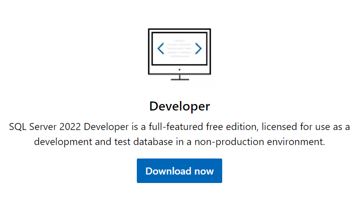

# Hospital Management System Database


The full documentation for the database can be found [here](https://dbdocs.io/manueldelarosa9722/Hospital-Management-System?view=relationships).

## About

This database is designed to streamline healthcare operations by providing a comprehensive solution
for managing patient records, medications, employees, and other essential administrative tasks.

## Project Setup

### Prerequisites

#### SQL Server

You have to download and install [SQL Server](https://www.microsoft.com/en-us/sql-server/sql-server-downloads). Select
the developer edition.



After downloading the software follow the installation wizard.

#### Software to Connect to SQL Server

_note_: You can use any one of the softwares listed below.

##### Azure Data Studio

You can download and install [Azure Data Studio](https://learn.microsoft.com/en-us/azure-data-studio/download-azure-data-studio?tabs=win-install%2Cwin-user-install%2Credhat-install%2Cwindows-uninstall%2Credhat-uninstall)

After downloading Azure Data Studio, follow the installation wizard. You can also visit the same download link
to read more about connecting to SQL Server with Azure Data Studio if you need help.

##### SQL Server Management Studio (SSMS)

You can download and install [SQL Server Management Studio](https://learn.microsoft.com/en-us/sql/ssms/download-sql-server-management-studio-ssms?view=sql-server-ver16). After downloading the software, you can follow along
with the installation wizard.

##### VSCODE

You can download and install [VSCODE](https://code.visualstudio.com/download). After downloading VSCODE, you can follow
along with the installation wizard.

_Note_: To use SQL Server with VSCODE you have to install the SQL Server (mssql) extension.

1. Once inside of VSCODE you can click on the extensions icon on the left side bar.

   

2. Search for sql server and select the one from Microsoft.

   

3. Click on the install button and it will automatically install.

### Clone Project

1. Clone the repository

```bash
git clone https://github.com/Manuel7806/Hospital-Management-System.git
```
